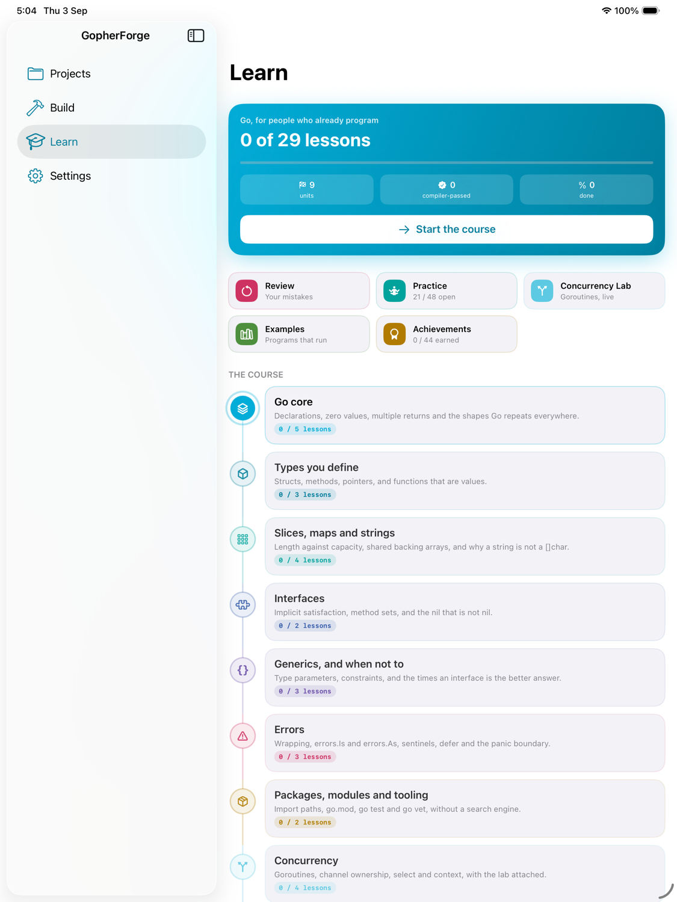
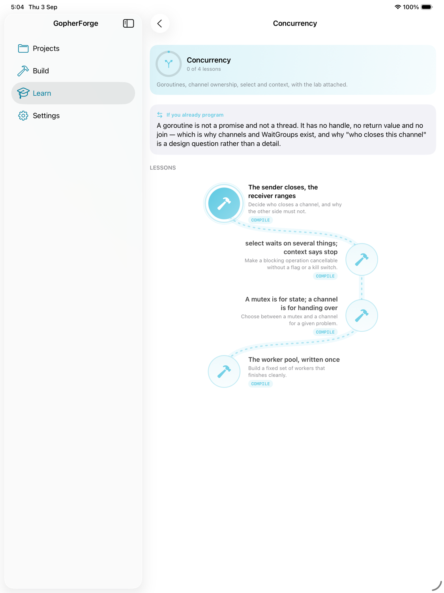
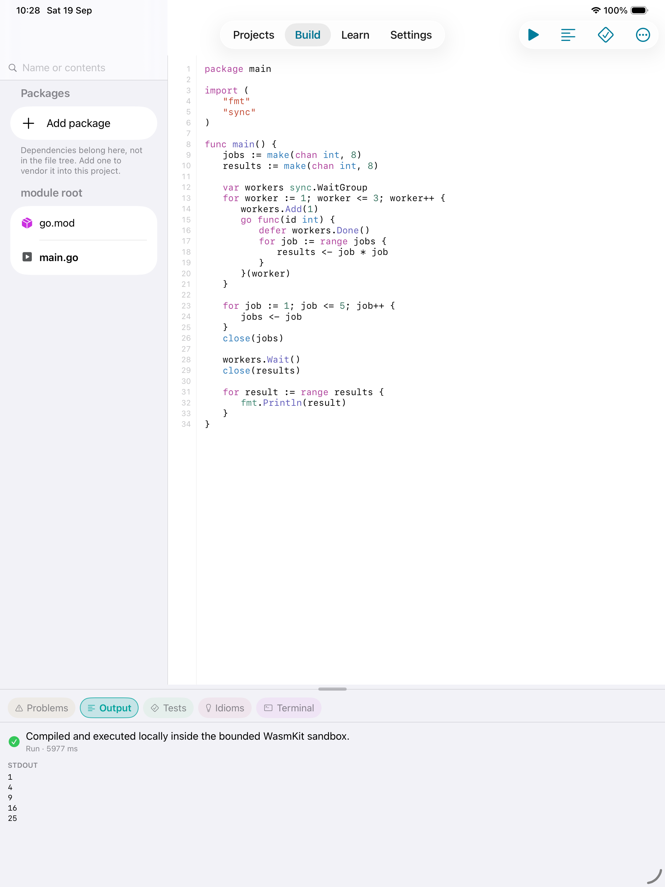
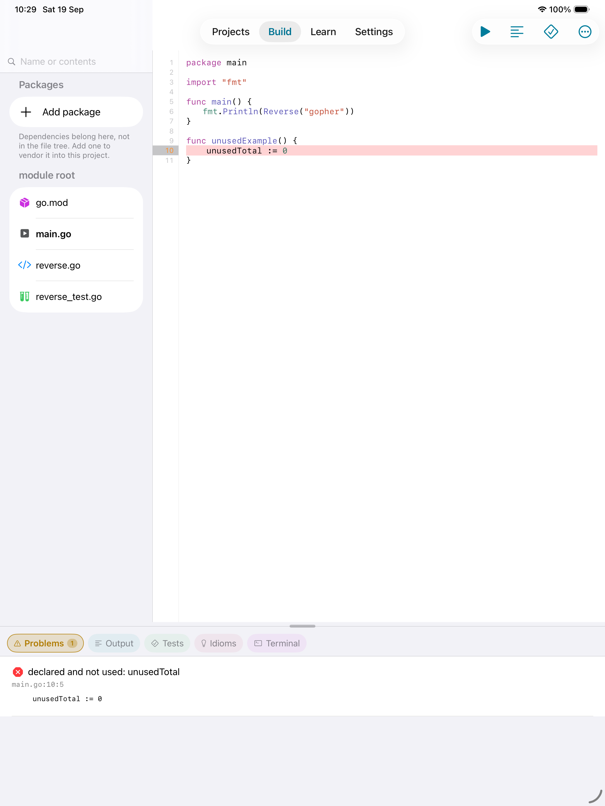
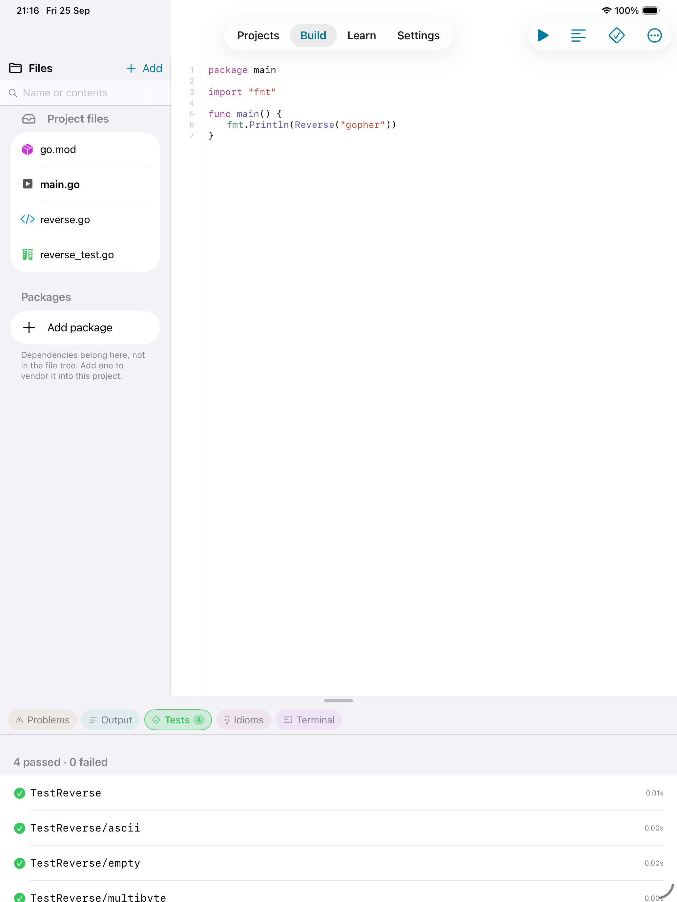
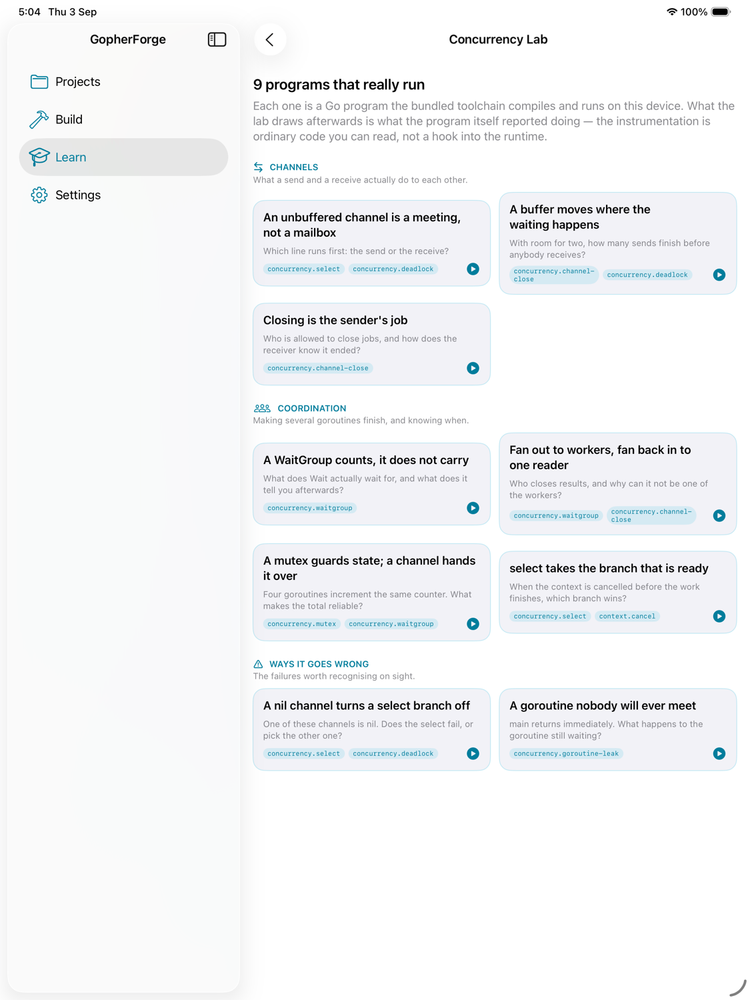
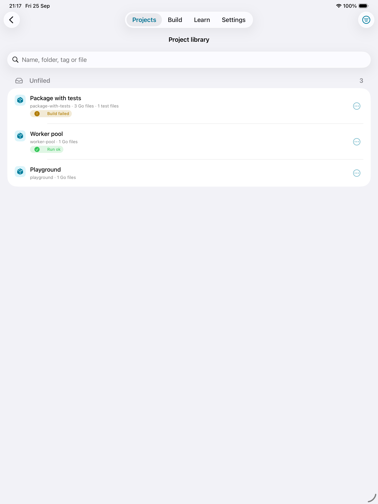
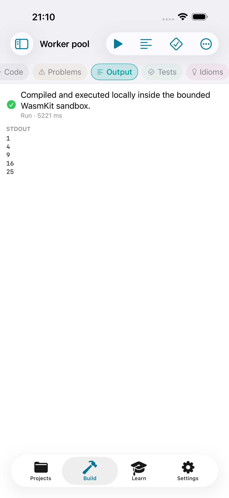

# GopherForge — native Go workspace for iPhone and iPad

GopherForge is an early-development **native SwiftUI application** for learning,
editing, checking, testing and running Go locally on iPhone and iPad. There is
no WebView, localhost server, JavaScript runtime, or cloud compiler in the app.

It is the Go sibling of [Crabrix](https://github.com/sergii-ziborov/crabrix),
not a rebadge of it: the compiler contract, the diagnostics, the course and the
two flagship features are Go's, and the shared parts are infrastructure rather
than screens.

> Forge real Go, anywhere.

## What it looks like

Every compiler result below is a real run of the bundled toolchain in the
Simulator — the test counts, the diagnostics, the program output and the
goroutine trace are what the app actually produced, not mock-ups.

| | |
| --- | --- |
|  |  |
| **The course is a journey.** Nine units on a rail, then the lessons inside one on a winding path. A node says whether it was ticked by hand or sealed by a compiler pass — and nothing is locked, because a course for people who already program is one they enter at goroutines. | **Inside a unit.** Every lesson is marked `READ` or `COMPILE` before it is opened, so it is clear which ones the toolchain will judge. |
|  |  |
| **Go, compiled and run on the device.** The file tree, the editor and the dock at once on iPad. Three goroutines, a jobs channel and a `WaitGroup` — built and executed inside the bounded WasmKit sandbox, with no network. | **Real diagnostics.** Go's own error text, parsed for line and column, with the line marked in the editor and in the gutter. |
|  |  |
| **`go test`, per case.** Run by the bundled toolchain and parsed from the same stream a developer reads, kept apart from diagnostics. | **Concurrency Lab.** Nine scenarios that print structured events from ordinary instrumentation; each one draws a lane per goroutine and names what blocked. |
|  |  |
| **Your projects, filed.** Search by name, folder, tag or file name — a project is often remembered as "the one with `parser.go`". Folders, tags, a star and a note, and nothing is ever evicted. | **iPhone.** The workspace becomes full-height tabs with the switcher at the top, where the keyboard cannot bury it. |

## What is built, and what is not

The hard product gate for this repository is:

> Can a bundled Go toolchain type-check, test and run Go locally inside an
> iPhone/iPad app while offline?

**In the Simulator, yes.** Hosting the Go compiler itself in WebAssembly was
this project's Gate A, and it closed on 2026-08-27 — with no patched Go at all.
`cmd/compile`, `cmd/link`, `cmd/vet` and `cmd/gofmt` cross-compile to
`wasip1/wasm` from a stock release and run under WasmKit; what cannot work is
`cmd/go`, which builds by spawning those tools as child processes, and WASI has
no way to spawn anything. So the app does the ordering itself and calls the
tools directly. A new Go release is a fifteen-second rebuild, not a rebase —
see [docs/TOOLCHAIN.md](docs/TOOLCHAIN.md).

What is still unproven is everything only real hardware can answer: the offline
claim, the thermal and memory envelope, and stopping a runaway program. That is
Gate B, in [docs/DEVICE-GATE.md](docs/DEVICE-GATE.md), and a Simulator run must
never be presented as if it had settled it.

Concretely, the app currently contains:

- an adaptive native `Projects / Build / Learn / Settings` shell — sidebar on
  iPad, tab bar on iPhone;
- a project library that keeps everything you make: folders, tags, a star and a
  note per project, grouped and searched by name, folder, tag or file name —
  because the project you are looking for is often "the one with `parser.go`
  in it" rather than whatever you called it six weeks ago. Nothing is evicted;
  the dashboard keeps a five-project strip and links to the rest;
- a workspace that changes shape by device: iPad shows the file tree, the editor
  and a dock at once, while iPhone becomes full-height
  `Code / Problems / Output / Tests / Idioms / Terminal` tabs with the switcher
  at the top, where the keyboard cannot bury it;
- a project console that maps `go build`, `go run`, `go test`, `go vet`,
  `go fmt`, `go mod`, `ls`, `cat`, `pwd` and `clear` to the app's own
  operations — app-scoped, never a shell;
- a course of 49 lessons across nine units, every code lesson shipping a
  complete answer that a gate compiles against that lesson's own hidden test —
  so a lesson nobody can solve fails the build rather than a learner;
- two of those units close gaps the course had no business having. **Types you
  define** teaches struct literals, methods and receivers, pointers, closures
  and escape analysis — the course previously taught `:=` and `switch` and never
  once showed how to declare a type of your own. **Generics** teaches type
  parameters, constraints with `~`, generic containers, and the cases where a
  plain interface is the better answer; Go has had them since 1.18, and a course
  without them teaches the language as it was in 2021;
- the course drawn as a journey rather than a list: the units on a rail on the
  Learn screen, and inside a unit its own lessons on a winding path. Each node
  says whether it was ticked by hand or sealed by a compiler pass. Nothing is
  locked — a course written for people who already program is one they enter
  sideways, at goroutines, because that is what they came for.
  The two shapes are deliberate. The winding path costs work per node on every
  frame of a scroll, and measured here it carried seven units and pinned the
  main thread for thirty seconds at nine; it stays where the node count is small
  and bounded, which is inside a unit;
- a lesson that says where it sits and where it goes: the unit, which lesson of
  how many, whether the toolchain judges this one, and the next lesson by name
  at the end. Finishing is two named things rather than one vague tick — Check
  hands the code to the lesson's hidden test, and the learner's own word is
  recorded as exactly that;
- a quiz closing each unit: one question at a time, four options, and the
  explanation the moment an answer is committed rather than at the end;
- a matching drill — terms on the left, meanings on the right, tiles of one
  fixed height so nothing moves while your thumb is reaching — whose wrong
  connections feed the same review queue a failed compile does;
- achievements earned by compiling, running, testing and fixing — eleven badges
  of four ranks each, where the bar measures the rung being climbed rather than
  the whole badge, so passing silver does not read as almost-gold;
- an example library: single-idea programs, five multi-package projects, a
  graphics section that computes pixels and writes PNGs the app displays — the
  Mandelbrot set, a hand-written colour wheel, plotted waves, Sierpinski by
  chaos game, and Life drawn as a filmstrip — and one project with `go-cmp`
  already vendored so it builds offline against a real dependency. A gate
  compiles, runs and checks the exact output of every one of them;
- package installation: resolve a module, see its popularity, licence and
  OpenSSF Scorecard, and vendor a checksum-verified copy into the project;
- a `UITextView` editor with Go and `go.mod` syntax highlighting, marked
  diagnostic lines, and an accessory row with three fixed regions: suggestions,
  a scrolling set of the symbols Go needs, and a control that puts the keyboard
  away. Long lines scroll sideways rather than wrapping, and the gutter numbers
  lines of the file — which is what a diagnostic points at, so a wrapped row
  counted as a line would mark code the compiler never mentioned;
- a compiler layer that stages a project into a job sandbox, runs one WASI
  module per phase, and parses what it wrote — format, vet, build, run, test;
- Go's plain-text diagnostics parsed for real, including package banners,
  column-less locations and the indented notes that belong to the finding above
  them;
- `go test` output parsed from the same stream a developer reads, kept apart
  from diagnostics;
- a build cache keyed on the toolchain tag, the phase and every file, so an
  unchanged program re-runs its stored artifact instead of rebuilding;
- **Idiom Coach**: a deterministic rule catalogue that flags Java-style getters,
  a context that is not the first parameter, discarded errors, upper-case error
  strings and a close in the receiving goroutine — each explaining itself, and
  repairing only the exact line it pointed at;
- **Concurrency Lab**: nine runnable scenarios on a shelf grouped by what they
  are about, each with its own page — the question, your prediction, the
  program, then a lane per goroutine showing what it did and how long it spent
  blocked. A goroutine that blocked and never came back gets a bar that runs off
  the end of the chart, which is what a leak looks like. The events come from
  ordinary instrumentation printed by the program itself, not from a hook into
  the runtime;
- interview preparation: fourteen questions a Go interview asks, each with what
  a strong answer covers and the plausible answer that is wrong. No multiple
  choice — an interview is answered out loud, and four options train
  recognition instead;
- **Spot the bug**: twelve short programs with one fault each, found by tapping
  the line. Every fault is unambiguous under the bundled Go, the guess cannot be
  taken back, and a miss feeds the same review queue a failed compile does;
- a nine-unit course written for people who already program, where a lesson
  passes when `go test` passes rather than when text matches;
- review chosen from the mistakes the compiler and the coach actually saw, with
  the reason shown on every item;
- four project templates that build offline with no dependencies at all;
- GitHub import: paste a repository URL, or send one in from another app
  through the Share Extension, and the snapshot is downloaded, filtered to text
  the editor can open, and turned into a project. A Share Extension queues URLs
  through an App Group and never tries to foreground the host app; a
  launch-time drain surfaces what it queued as something tappable;
- Files import of a folder, a `.tar.gz` this app exported, or a
  `.gopherforgeproject` package, opening the module root rather than the
  checkout root, bounded in file count and size;
- a navigator whose search groups hits by file rather than listing a file once
  per match, and marks what it matched in the code as well as in the sidebar;
- panes that follow the work: a finished run opens Output, a failure opens
  Problems, and a test run opens Tests, so pressing Run never leaves you
  staring at the source it just left behind.

Anything that needs the toolchain says so rather than offering a button that
can only fail: Build, Run, Test, the lab and every compile lesson are disabled
with the toolchain's own reason shown while none is staged.

The toolchain is staged **at build time** — built from the Go on the machine,
or unpacked from a pinned archive verified by SHA-256 — and copied into the app
bundle. The running app never downloads compiler components.

## Boundaries, stated up front

- **cgo is not supported.** It needs a native C toolchain.
- **A package is installed once, then it is source.** The Packages screen
  resolves a module through `proxy.golang.org`, checks the download against
  `sum.golang.org` before writing anything, and vendors the result into the
  project. The compiler still runs with `GOPROXY=off`: it never sees a network,
  and every build after an install is offline. What is not done is verifying
  the checksum database's signed transparency-log proof — the trust there is
  TLS to the official endpoint, and that limit is stated in the app.
- **No network from a guest program.** One writable preopen, `/sandbox`, and no
  network imports.
- **`GOOS=wasip1`, not `js/wasm`.** The memo this product came from assumed a
  browser; this app has no JavaScript engine, so both the toolchain and the
  programs it builds target WASI and run in the same interpreter. There is no
  `wasm_exec.js` anywhere in the repository.
- **No `cmd/go` in the bundle, on purpose.** It builds by spawning the compiler
  and the linker, and WASI cannot spawn. The app plans the build itself, which
  is what keeps the bundled Go unpatched.

## License and ownership

GopherForge is commercial proprietary software, not an open-source MIT project.
Copyright © 2026 Serhii Ziborov. All rights reserved. See [LICENSE](LICENSE).

Bundled third-party components keep their original licenses, including the Go
toolchain and standard library under the BSD 3-Clause license of the Go
project. Attributions are maintained in
[GopherForge/Resources/ThirdPartyNotices.md](GopherForge/Resources/ThirdPartyNotices.md).

The Go gopher was designed by Renée French and is not used here. The app's
mascot is a gopher of our own — a different silhouette and a different face,
drawn from scratch in `scripts/make_app_icon.swift` so the icon is reproducible
from source rather than a binary nobody can regenerate. Go's published brand
colours are used as colours; no Go mark, logo, or gopher is reproduced, and
nothing here implies endorsement by the Go project.

`ThirdPartyNoticesTests` fails the build if a bundled dependency is missing
from the notices or recorded under the wrong licence, and
`scripts/build_toolchain.sh` refuses to produce a toolchain artifact unless
Go's own `LICENSE` and `PATENTS` are staged beside it — shipping the compiled
tools without them would not satisfy the BSD 3-Clause redistribution terms.

## Shipping

What a submission to Apple needs, what has already been settled, and the
findings from the pre-submission review are in
[docs/APP-STORE.md](docs/APP-STORE.md). The privacy policy — the app collects
nothing — is [PRIVACY.md](PRIVACY.md), and must be published at a public URL
before submitting.

## Build

Requirements:

- Xcode 27 beta or newer (Swift 6.3+ is required by WasmKit 0.3.1);
- XcodeGen;
- `zstd` on the build Mac.

```bash
./scripts/bootstrap.sh
DEVELOPER_DIR=/Applications/Xcode-beta.app/Contents/Developer \
  xcodebuild -project GopherForge.xcodeproj \
  -scheme GopherForge \
  -destination 'platform=iOS Simulator,name=iPad Pro 13-inch (M5),OS=26.5' \
  build
```

The first build stages the toolchain. With Go installed it is built here, from
that release, in about fifteen seconds:

```bash
scripts/build_toolchain.sh
```

That output is roughly 180 MB and is deliberately not committed: it is build
artefacts cut from an unpatched Go, so it is something to reproduce rather than
to store. On a machine with no Go and no pinned artifact, `bootstrap.sh`
continues anyway and the app runs with the compiler reported as missing. That
state is visible in the Build banner and in Settings, and every compiler gate
treats it as a failure rather than a skip.

### On a device

The signing team is already in `project.yml`, and Xcode provisions both the app
and its extension automatically. Plug the iPhone or iPad in, unlock it, trust
the Mac, then:

```bash
./scripts/install_device.sh
```

It finds the connected device, builds signed, installs and launches. Pass a
device identifier from `xcrun devicectl list devices` to choose between several.

**It builds Release, and that is not a preference.** The whole product runs
inside a Wasm interpreter, and an unoptimised WasmKit is slower by orders of
magnitude — measured here, a Debug gate run in the Simulator does not finish
where a Release one takes nineteen seconds. On a phone that difference reads as
a Build button that does nothing at all. Pass `debug` only when you need a
debugger attached and know what you are trading for it.

Everything the compiler gate can only prove on real hardware — airplane mode,
the thermal envelope, stopping a runaway program — is listed in
[docs/DEVICE-GATE.md](docs/DEVICE-GATE.md).

## Verification

The normal test scheme excludes the expensive compiler gates:

```bash
DEVELOPER_DIR=/Applications/Xcode-beta.app/Contents/Developer \
  xcodebuild -project GopherForge.xcodeproj \
  -scheme GopherForge \
  -destination 'platform=iOS Simulator,name=iPad Pro 13-inch (M5),OS=26.5' \
  test
```

That scheme runs both suites. The UI tests drive the real app in the Simulator:
they open a template and check it lands in the editor, type into the buffer,
switch panes, select a file in the tree, walk the course into a lesson, dismiss
the keyboard from its own row, and assert that every action needing the compiler
is offered exactly when a compiler is staged — written as that invariant rather
than as one configuration, because both states are real. They address elements
by accessibility identifier rather than by visible text, so a copy edit cannot
silently stop a test from checking anything.

Run the real bundled-toolchain gates with the dedicated scheme, which requires a
staged toolchain and its own configuration:

```bash
DEVELOPER_DIR=/Applications/Xcode-beta.app/Contents/Developer \
  xcodebuild -project GopherForge.xcodeproj \
  -scheme GopherForgeCompilerGate \
  -configuration Gate \
  -destination 'platform=iOS Simulator,name=iPad Pro 13-inch (M5),OS=26.5' \
  test
```

`Gate` is a third configuration and it earns its place: these tests run a real
Go build inside the Wasm interpreter, which is unusably slow unoptimised, and
they cannot run in plain Release because `@testable import` needs a testability
a shipped binary should not carry. Each run also clears the build cache first —
a cached artifact makes a build that never happened look exactly like one that
did.

Measured on an M-series Mac in the Simulator, Go 1.24.2, cold cache:

| | |
| --- | --- |
| hello-world: compile, link and run | 3.2 s |
| two-package module | 3.9 s |
| `declared and not used` reported | 0.4 s |
| table-driven `go test`, per-case results | 6.9 s |
| three repeated runs, cache warm after the first | 2.5 s total |

These are Simulator numbers on a Mac and nothing more. What a phone does is
Gate B, and no number here anticipates it.

## Success criteria

The compiler gate passes only when all of these are demonstrated on a physical
iPhone or iPad:

1. airplane mode is enabled before launch;
2. the app reports the bundled `compile.wasm` and `link.wasm` and their Go
   version;
3. **Build** produces a real `declared and not used` diagnostic at the right
   line and column;
4. the repaired program compiles and **Run** prints its output;
5. **Test** runs a table-driven `_test.go` and reports per-case results;
6. a multi-package module inside one `go.mod` builds and runs;
7. repeated builds stay within an acceptable memory and thermal envelope;
8. a non-terminating program can be stopped without leaving runaway work.

Items 1, 7 and 8 cannot be claimed from a Simulator run. See
[docs/DEVICE-GATE.md](docs/DEVICE-GATE.md).
