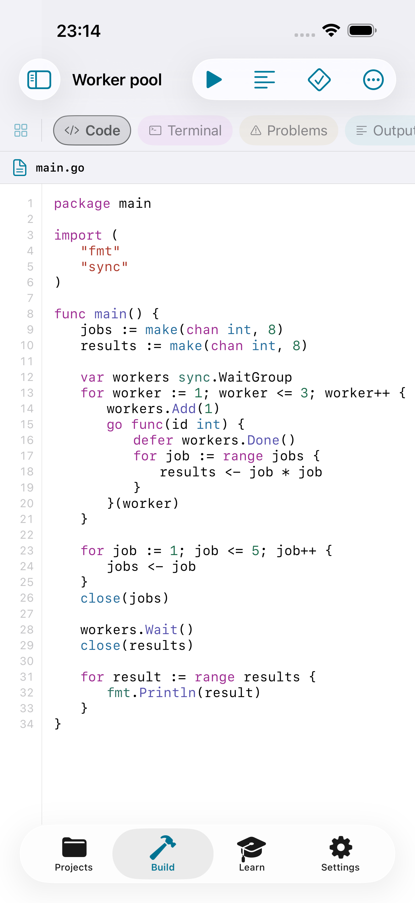
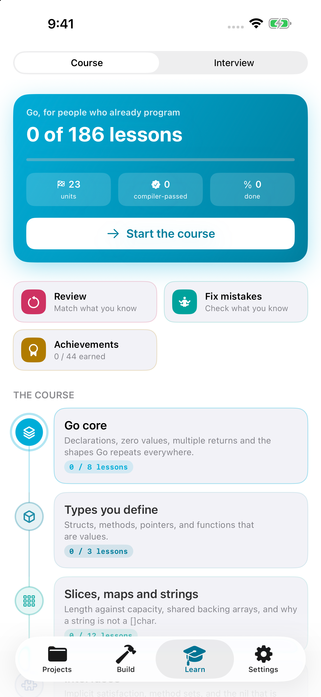
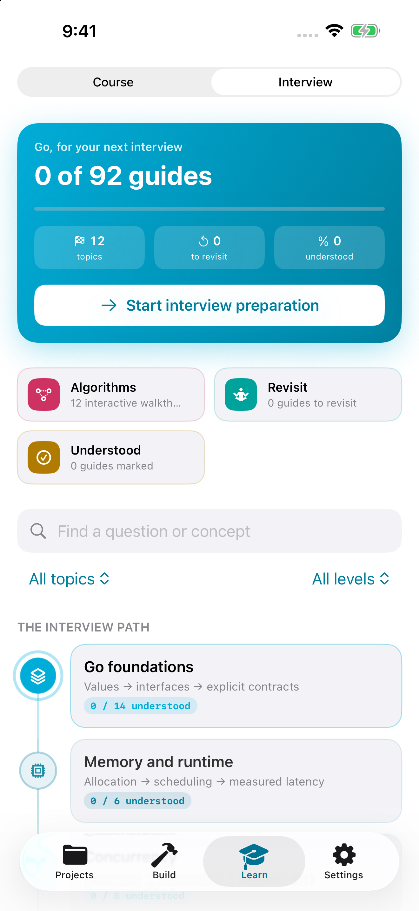

# GopherForge


A native Go workspace for iPhone and iPad. Write, compile, run, test and learn
with a bundled Go 1.27.1 toolchain.

[App Store](https://apps.apple.com/app/id6809702319) ·
[Website](https://gopherforge.app) ·
[Course](https://gopherforge.app/learn) ·
[Interview preparation](https://gopherforge.app/interview) ·
[News](https://gopherforge.app/news) ·
[App guide](https://gopherforge.app/guide) ·
[Support](https://gopherforge.app/support)



## Releases

| Version | Status, checked 28 October 2026 | Changes |
| --- | --- | --- |
| **1.3.0 (46)** | TestFlight · Waiting for App Review | Offline React/npm subset, isolated Go API capability and automatic source debugging with breakpoints. |
| **1.2.0 (45)** | Available on the App Store | 15 readings on JSON v2, SQL, modern concurrency and agents; 92 interview guides, 12 algorithm labs, new icon and app guide. |
| **1.1.6 (44)** | Available on the App Store | Two ownership readings: borrowed bytes, Scanner tokens and sync.Pool. 171 teaching lessons and 124 readings. |
| **1.1.5 (43)** | Available on the App Store | Continue for Course and Interview, matching learning layouts, saved progress, and compact Projects/Learn/Settings roots. Fresh learning screenshots for six device sizes. |
| **1.1.5 (42)** | Superseded by build 43 | Removed duplicate root headings while retaining titles and Back navigation inside details. |
| **1.1.4 (39)** | Previous App Store release | MongoDB/Redis and production tooling, 88 interview guides, eight interactive algorithm labs, transparent scroll endings. |
| **1.1.3 (37)** | Previous App Store release | Architecture comparisons, clean Go, all 23 classic patterns and six concurrent Go patterns. |
| **1.1.2 (36)** | Previous App Store release | Practical command-line, container and Kubernetes lessons. |

The store currently distributes **1.2.0 (45)**, verified on 28 October 2026.
It includes the expanded
curriculum, corrected exercise examples and the selected dark teal gopher icon.
Web material is available with the same stable identifiers. Existing completion, bookmarks
and Continue storage formats are preserved.
**1.3.0 (46)** is available in Internal QA TestFlight and submitted to App Review
with the documented offline npm/React mode, bounded local Go API capability and
automatic source debugger. Automatic publication after approval is enabled.
The external GitHub project used for verification is not bundled in the app.
[Review submission](docs/releases/1.3.0-submission.json) · [Store assets](docs/releases/1.3.0-assets-verified.json) · [Review QA](docs/releases/1.3.0-review-qa.json) · [Beta receipt](docs/releases/1.3.0-beta.json) · [Focused QA](docs/releases/1.3.0-beta-qa.json).
TestFlight access is private; there is no public invitation link.
Release status is a dated snapshot, not a live indicator.

[Submission receipt](docs/releases/1.2.0-submission.json) ·
[Asset verification](docs/releases/1.2.0-assets-verified.json) ·
[QA results](docs/releases/1.2.0-qa.json) ·
[Version history](https://gopherforge.app/updates) ·
[Release records](docs/releases).

The app is a one-time purchase: US $6.99, US $4.99 in Ukraine, with localized
App Store prices elsewhere. No subscription or in-app purchase.

## What you can do

- **Build real Go.** Compile, run, test, vet and format on device. Compiler
  diagnostics point to source locations; test results are shown per case.
- **Keep your projects.** Editable multi-package sources, a searchable file
  tree, folders, tags, favorites and autosave. Import GitHub snapshots or Files
  folders; export and share your work.
- **Use the screen you have.** A compact iPhone editor, an iPad file tree and
  resizable dock, and adaptive Duo layouts. In laptop posture, code or Terminal
  stays above the hinge while keyboard or results occupy the lower display.
- **Learn Go.** 186 teaching lessons in 23 units, including 139 readings,
  plus 22 prediction challenges. Worked Go programs, diagrams, matching
  reviews and three-choice mistake practice accompany the material.
- **Continue studying.** Reopen the last course lesson or interview guide.
  The selected learning area, lesson completion, compiler-verified evidence
  and personal interview marks persist locally. Opening a page saves your
  place; it does not mark the material complete.
- **Explore concurrency.** Nine runnable Concurrency Lab scenarios show the
  events their goroutines and channels report as timelines.
- **Prepare for interviews.** A separate area with 92 worked guides, 12 topics,
  four difficulty levels and twelve interactive algorithm labs with 36 input
  scenarios. Course progress and interview self-assessment stay independent.
- **Read idiomatic code.** A deterministic, rule-based Idiom Coach, 14 original unit
  interview questions and 12 spot-the-bug exercises.
- **Try working examples.** Multi-package programs, Go-generated PNGs, and
  HTML/CSS/JavaScript projects previewed locally in WebKit.

### Architecture and patterns

The course includes **19 architecture lessons**, **eight clean-code lessons**,
all **23 classic design patterns** and **six concurrency and resilience patterns**.
Scenario-based architecture ratings compare suitability for tools, domain-rich
applications and services; they are editorial guidance, not universal rankings.
Worked programs, diagrams, tradeoffs and independent review questions accompany
the material.

The 19 architecture and eight clean-code readings now include 81 further
sections on package structure, consistency, transactions, failure recovery,
API contracts, testing and incremental migration. Lesson IDs and saved progress
remain unchanged.

### Data stores and production tooling

Six MongoDB and six Redis readings are included in **Around Go: MongoDB
and Redis**. They cover shared clients, indexes, optimistic updates,
transactions, cursors, pool saturation, cache-aside, pipelines, leases,
consumer groups and latency/memory evidence. Go v2 MongoDB and go-redis v9
examples name their pinned versions and distinguish fragments from full programs.
Network examples run in a native development environment; WASI networking
and the existing module archive budgets are unchanged.

Packages, modules and tooling contains **14 teaching lessons**,
with the three existing prediction challenges preserved. Twelve new readings
explain version selection, checksums and private modules, workspaces, vendor,
embedded/generated inputs, parallel tests, benchmarks, profiles, build capacity,
toolchain/tool pins, fuzzing and startup/shutdown ownership. Every new reading
has a flow diagram, primary references, its own matching pair and a three-choice
review question.

Native code and lessons remove the lower scroll-edge backdrop and keep extra
end space inside scrollable content. This adds no source lines and preserves
the embedded-versus-full-screen lesson scrolling behavior.

### Web previews and Gin compatibility

Gin-style templates use an educational compatibility layer rather than the full
upstream Gin framework. Registered handlers are exercised through `httptest`;
the native app serves compatible local preview files. An arbitrary Go backend
cannot bind a listener inside the WASI guest. Full Node.js/npm runtimes are not bundled.
Full Gin/database services need an external native environment.

#### 1.3.0 beta: isolated offline React and source debugging

The beta adds **React + Gin study board** in Examples → Offline frontend. This feature is **not in the current App Store 1.2.0 (45) binary**. It bundles
esbuild 0.28.2 as WASI and a fixed browser catalog: React / React DOM 19.3.1
and scheduler 0.28.0. The installed app needs no registry or server for this mode.

```text
frontend packages
npm install --offline
npm run build
frontend preview
```

Open Output for the preview. `frontend install/build` and the supported npm
commands invoke this app's bounded frontend builder, **not a full npm runtime**.
The compiler transpiles JS/JSX/TS/TSX, bundles browser imports, local JSON and CSS, and handles
SVG/text imports. TypeScript is not type-checked. Edit components, reducers,
forms or styles, then rebuild; stale previews are invalidated.

The preview reads generated assets and `web/api/*.json` through an isolated
WebKit scheme with no TCP listener. External HTTP(S), WebSockets, workers,
frames and popups are blocked. Preview browser data is temporary. Project
sources and generated output are autosaved in the project library.

Only bundled package versions are accepted. Package scripts must explicitly
use `gopherforge build` / `gopherforge preview`; lifecycle hooks, arbitrary
scripts, Node APIs, native addons, Vite plugins and remote package installation
are not supported. An explicit `gin-replay` recipe enables local requests to
real Go handlers through the educational Gin-compatible layer. Requests rebuild
small deterministic in-memory state using a bounded mutation log; no socket,
cloud runtime or general production server is added. The built-in study board
uses static JSON fixtures. A pinned external React + Gin GitHub project was used
only for interoperability tests; its code and example are not bundled in the app.
See the [offline frontend guide](docs/OFFLINE_FRONTEND.md) for the recipe and limits.

Tap a Go line number to set a breakpoint. **Run is unchanged with no breakpoints;
with breakpoints it automatically starts the beta source debugger.** Continue,
Step Into/Over/Out, Stop, an own-source call stack and bounded current-frame
locals are available. Temporary probes never overwrite saved source. Breakpoints
persist per project. This is a teaching source debugger, not full Delve:
[debugger guide](docs/SOURCE_DEBUGGER.md).

### JSON v2, modern concurrency, SQL and agents

The 1.2.0 curriculum adds fifteen worked readings. Three cover JSON v2 contracts,
presence/null semantics and input policy. Three explain WaitGroup.Go, deterministic
synctest timing and errgroup ownership. **Around Go: SQL services** has five lessons
on pools, row cleanup, transaction ownership, isolation/locking and bounded retries.
**Around Go: coding agents** has four lessons on practical workflows, repository
instructions, generated API verification and trust boundaries. SQL and agent
examples target an external native environment, not new app network integrations.

The audit also corrected Stack.Pop's retained references, Sum's numeric type
constraint and the three language-level iterator signatures. All existing lesson
IDs are preserved. The detailed [app guide](https://gopherforge.app/guide) explains
projects, testing, Continue, practice, package budgets and the sandbox.

### Interview preparation and coding agents

Learn has a separate **Interview** area, mirrored at [gopherforge.app/interview](https://gopherforge.app/interview), free on the web without registration. It contains **92 worked guides across 12 topics**, from Junior to Staff / expert: Go values and interfaces, memory/runtime, concurrency, algorithms, architecture, HTTP/SQL, testing/performance, modules/tooling, MongoDB, Redis, Docker/Kubernetes and workflows with Claude Code, Codex and Cursor. Each guide has answer reasoning, a common trap, a worked exercise, a follow-up and primary references. Difficulty is editorial guidance, not a hiring guarantee or an exhaustive list of possible questions.

Twelve algorithm laboratories cover lower-bound binary search, two sum, sliding windows, BFS, Dijkstra, top-K, merging, minimum-coin dynamic programming, topological sorting, union-find, LRU eviction and merging closed intervals. Choose among **36 scenarios** and step through computed states, including empty, duplicate, cyclic and unreachable inputs. These deterministic teaching traces include highlighted state, Go implementations and complexity. They do not execute arbitrary web input. `python3 scripts/verify_interview_algorithms.py` compiles all twelve examples, checks the original 500 randomized rounds and new 200-round property cases with Go's race detector.

Interview self-assessment is stored locally, independently from lesson completion and compiler verification. Eight **Go with coding agents** guides cover Claude Code, Codex and Cursor, repository context, generated API and dependency verification, permissions and prompt injection, concurrent-code review and independent engineering judgment. The app does not connect to AI providers; these guides teach workflows in your own development environment, with official documentation links. Tool interfaces and behavior may change; follow the version actually installed.

### Course and Interview screenshots

Current native screens, captured from the app rather than reconstructed mockups:




### Next.js website

The [website source](website/README.md) mirrors the public course, interview
preparation and algorithm demonstrations. Course and Interview use consistent
learning trees and readable highlighted code. **Continue**, filters, completion
marks and interview self-assessment are saved in browser-local storage and
survive a return visit when that storage is retained. App and browser progress
are independent; there is no account-based synchronization.

The site also offers an architecture comparison, a practical blog and
[ten original News articles](https://gopherforge.app/news), with source links,
illustrations and infographics. A separate [community feed](https://gopherforge.app/news/feed)
imports licensed Go news twice daily. Event dates are distinguished from
publication dates. Course, interview and original News pages have individual
metadata, structured data and entries in the [sitemap](https://gopherforge.app/sitemap.xml).

Lessons and interview preparation need no registration. The site does not
execute or upload arbitrary code. It is hosted on Hetzner through Hostwatch,
with query-free access-log analytics; domain registration and DNS remain in
Lovable. [Deployment and recovery](website/README.md).

[Browse the course](https://gopherforge.app/learn) ·
[Prepare for interviews](https://gopherforge.app/interview) ·
[App screenshots](docs/app-store/screenshots)

## Packages and offline work

The compiler ships in the app; it is not downloaded at launch. Once project
sources and dependencies are present, builds run locally.

GitHub imports and package downloads need a connection. Pure-Go module archives
are checked against the Go checksum service before vendoring. In the current
source (1.1.1 onward), building prepares missing modules required by imports
using the versions already declared in `go.mod`. This is not a complete
replacement for Go's module solver. The earlier 1.1 release requires adding transitive
dependencies separately.

**A module must fit the archive limits:** at most **4,000 files**, **96 MiB
compressed**, and **512 MiB uncompressed**. File count includes every
non-directory entry in the downloaded ZIP, before tests, other-platform files
and unused source are filtered out; it is not a count of files the project
ultimately keeps. Automatic dependency preparation is limited to 80 modules
per pass.

For example, `modernc.org/libc@v1.75.3` contains **4,168 archive files** and is
refused before compilation. Retry cannot bypass this limit for the same
archive. A compatible smaller version or dependency may help when the
project's requirements allow it; passing the archive limits still does not
guarantee WASI compatibility. These are GopherForge resource budgets, not Go
language limits. [How the limits work](docs/PACKAGES.md#archive-budgets).

Settings → **Clear downloaded packages** removes dependency source across saved
user projects while keeping their code and dependency versions. Lessons and
built-in Examples are excluded. Packages download again when needed. This
control is available from version 1.1.1.

See [package behavior and limits](docs/PACKAGES.md).

## Limits

- Go programs run in a bounded WASI sandbox. cgo, native assembly and guest
  network sockets are unsupported.
- Module archives are capped at 4,000 files, 96 MiB downloaded and 512 MiB
  uncompressed, counted before platform/source filtering.
- The project console runs app operations; it is not a shell or SSH session.
- Local web previews are not public hosting. Imported HTML or JavaScript can
  make requests to remote services.
- Vendoring does not preserve arbitrary non-Go `go:embed` assets. `go.work`
  semantics and full module-version solving are not implemented.
- A tight infinite loop has no guaranteed Stop; close and reopen the app.
  There is no enforced aggregate guest file-write quota. Memory and captured
  output limits do not bound CPU time or writes to allowed guest files.
  [Execution contract](docs/RUNTIME_LIMITS.md).
- Compile-and-run has been demonstrated on a physical iPhone. Airplane-mode
  operation and sustained thermal/memory behavior remain unverified; simulator
  checks do not establish those results.

## Build and contribute

The app supports iOS/iPadOS 18 and later. Building requires Xcode 27.1
with the Duo SDK, XcodeGen and `zstd`.

```bash
./scripts/bootstrap.sh
DEVELOPER_DIR=/Applications/Xcode.app/Contents/Developer \
  xcodebuild -project GopherForge.xcodeproj \
  -scheme GopherForge -configuration Release \
  -destination 'generic/platform=iOS Simulator' \
  SWIFT_SUPPRESS_WARNINGS=NO build
```

[Build, device installation and tests](docs/BUILDING.md) ·
[Toolchain design](docs/TOOLCHAIN.md) ·
[Report an issue](https://github.com/sergii-ziborov/GopherForge/issues)

The [public lesson catalog](docs/website/lessons.json) supplies the read-only
website course without exposing hidden tests or verified exercise solutions.

## Privacy and license

No account, ads or tracking in the native app. Optional network requests and
user-selected file providers are described in [PRIVACY.md](PRIVACY.md).
Website hosting has its own operational logging; see the
[website privacy page](https://gopherforge.app/privacy).

GopherForge is proprietary software with publicly readable source, not an
open-source project. Copyright © 2026 Serhii Ziborov. All rights reserved.
[License](LICENSE) · [Third-party notices](GopherForge/Resources/ThirdPartyNotices.md) ·
[Support](SUPPORT.md) · [Terms](https://gopherforge.app/terms)

GopherForge is independent and is not affiliated with or endorsed by Google or
the Go project.

### October journal expansion

The [journal](https://gopherforge.app/news) now contains fifteen original long-form
articles. Five additions cover the 2026 developer survey, gopls 0.24, slice
backing storage, borrowed buffers/pooling and typed nil errors. Each new article has more than
2,000 words of prose, three original generated illustrations, highlighted
runnable examples where relevant, primary references and links into the course.
Edition dates fill unused archive days; actual publication dates remain separate.
News and evergreen technical guides use distinct structured-data types.

The two new course readings are
[borrowed bytes](https://gopherforge.app/learn/stdlib.borrowed-buffers) and
[pool ownership](https://gopherforge.app/learn/runtime.pool-ownership).
The native catalog is the source for both platforms; browser and app progress
remain independent.

## Audit roadmap — development branch

The [28 October audit plan](docs/audits/2026-10-28-plan.md) tracks source-safety fixes before further learning and Playground work. The current development branch adds coordinated library writes, preserved conflict copies, scoped dependency publication, reviewed file-specific idiom repairs, strict terminal commands and a [visible import inventory](docs/IMPORT_SNAPSHOTS.md). These are not claims that every roadmap package or physical provider gate has passed. Apple release identity remains in `docs/releases/`; source implementation is not the same as a shipped build.
